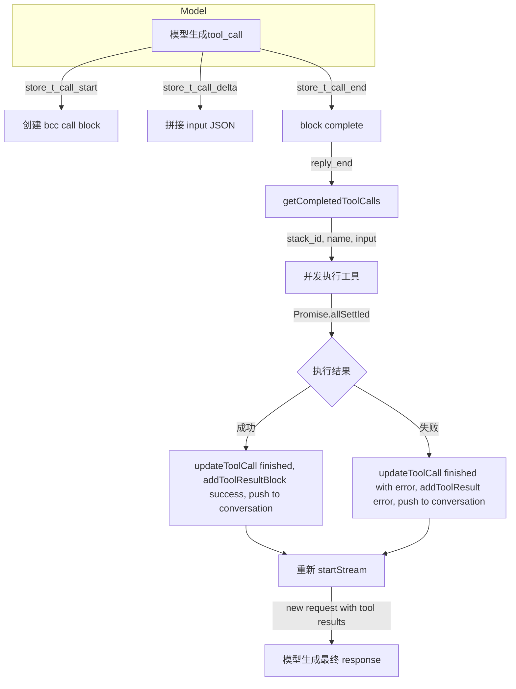
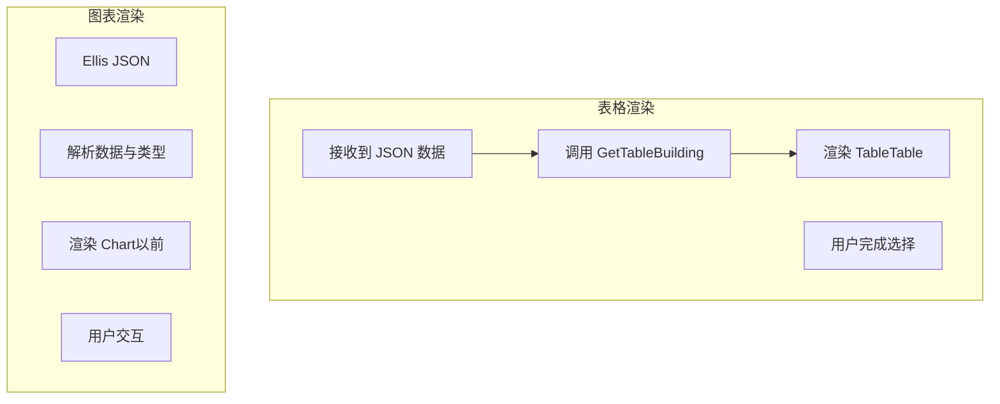

# 流式数据处理架构

## 概述

本项目支持三种网络传输协议和多种 AgentScope 事件类型，对文本、思考过程、工具调用、媒体数据、结构化 UI 等不同类型的数据进行统一的流式处理、状态管理和渲染。

### 数据流总览

```
用户输入
  → useStreamProtocol.sendMessage()
    → 构建 OpenAI 格式请求（系统提示 + 历史 + 工具）
    → createStreamProtocol() 创建协议适配器
      → 发起 HTTP/WS 连接

  [网络返回流式数据]

  → 传输层解码为文本
  → parser 解析为 AgentScopeEvent[]
  → 遍历事件，StreamProcessor.handleEvent() 进行状态管理
    → 根据事件类型更新反应式 Map
    → 文本 delta 检测 GenUI → 可能切换 block type
    → 渲染层通过 getOrderedBlockStates() 获取有序 block 列表

  → reply_end 触发 agentic 循环：
    → getCompletedToolCalls() 提取完成的工具
    → 并发执行工具
    → 追加结果到对话历史
    → 重新 startStream()
```

### 架构层次

| 层次 | 说明 |
|------|------|
| 传输协议层 | 负责接收原始网络数据，支持 SSE/WebSocket/NDJSON 三种协议。位于 `src/protocols/` |
| 事件解析层 | 将原始数据映射为统一的 `AgentScopeEvent` 类型；兼容 OpenAI 和 AgentScope 两种格式。位于 `src/protocols/parser.ts` |
| 状态管理层 | 根据事件序列更新内部 block 状态，最终输出有序 block 列表。位于 `src/events/processor.ts` |
| 渲染层 | BlockRenderer 根据 block type 动态选择渲染组件。位于 `src/components/blocks/` |

---

## 一、传输协议层

三种协议适配统一实现 `StreamProtocol` 接口，通过工厂方法按需创建。

### 1.1 工厂

**`src/protocols/index.ts`**

```ts
createStreamProtocol(type: ProtocolType): StreamProtocol
```

根据配置的协议类型（sse / websocket / ndjson）创建相应的适配器。

### 1.2 协议适配器

| 协议 | 文件 | 方式 | 特点 |
|------|------|------|------|
| SSE | `sse.ts` | `fetch()` POST + `ReadableStream` + `TextDecoder` | 默认协议；逐个二进制块读取，解码后累加缓冲区，调用 `parseSSEChunk` 解析 |
| WebSocket | `websocket.ts` | `new WebSocket(url)` | 双向通信；支持自动重连(最多5次)，用 `setInterval` 间隔(默认3秒)；需要手动发送 body |
| NDJSON | `ndjson.ts` | `fetch()` + `ReadableStream` | 每行一个完整 JSON；按 `\n` 分割，逐行 `JSON.parse` |

### 1.3 StreamProtocol 接口

```ts
interface StreamProtocol {
  connect(url: string, options?: ConnectionOptions): void;
  close(): void;
  send(data: unknown): void;
  onMessage(handler): () => void;   // AgentScopeEvent
  onError(handler): () => void;
  onClose(handler): () => void;
  onStatusChange(handler): () => void;  // idle/connecting/connected/streaming/error/disconnected
}
```

### 1.4 通用流接口

```ts
export interface ConnectionOptions {
  headers?: Record<string, string>;
  body?: unknown;
  reconnect?: boolean;
  reconnectInterval?: number;
  maxReconnectAttempts?: number;
}
```

---

## 二、事件解析层

将原始二进制/文本数据转换为统一的 `AgentScopeEvent` 类型。支持两种格式。

### 2.1 SSE 解析

**`src/protocols/parser.ts`**

```ts
parseSSEChunk(buffer: string): { events: AgentScopeEvent[]; remainder: string }
```

- 按 `\n` 切分输入
- 每行去除 `data:` 或 `data: ` 前缀
- `[DONE]` 行映射为 `reply_end`
- JSON 行交由 `mapRawToEvents` 处理

### 2.2 事件映射（mapRawToEvents）

支持两种格式：

#### OpenAI `chat.completion.chunk` 格式

**条件：** `raw.object === 'chat.completion.chunk'`

| 字段 | 映射为 |
|------|--------|
| `delta.role` | `reply_start` |
| `delta.content` | `text_block_delta` |
| `delta.tool_calls[]` | `tool_call_start` + `tool_call_delta` |
| `finish_reason == 'tool_calls'` | `custom` + `tool_calls_finish` + `reply_end` |
| `finish_reason` (other) | `reply_end` |

tool_calls 支持 index 缓存：使用 `toolCallIdByIndex` 映射 index 到真实 tool_call_id，后续的 argument delta 通过 index 找到正确的 ID。

**格式示例：**

```json
{
  "object": "chat.completion.chunk",
  "choices": [{
    "index": 0,
    "delta": {
      "role": "assistant",
      "content": "Hello",
      "tool_calls": [{"index": 0, "id": "call_xxx", "function": {"name": "get_weather", "arguments": "{\"loc"}}]
    },
    "finish_reason": null
  }]
}
```

#### AgentScope 2.0 JSON 格式

| 条件 | 映射事件 |
|------|----------|
| `event = 'reply_start'` | `reply_start` |
| `object = 'response' && status = 'completed'` | `reply_end` |
| `content[0].type = 'text'` | `text_block_delta` |
| `content[0].type = 'tool_use' / 'tool_call'  ` | `tool_call_start` |
| `raw.type = 'text_block_delta' / 'text'  ` | `text_block_delta` |
| `raw.type = 'tool_call_delta'` | `tool_call_delta` |
| `raw.type = 'tool_result_end'` | `tool_result_end` |

如果以上都不匹配，则作为 `custom` 事件处理。

### 2.3 AgentScope 事件类型

共 22 种 AgentScope 事件：

| 类别 | 类型 | 说明 |
|------|------|------|
| 回复 | `reply_start`, `reply_end` | 流开始/结束 |
| 文本 | `text_block_start`, `text_block_delta`, `text_block_end` | 文本增量 |
| 思考 | `thinking_block_start`, `thinking_block_delta`, `thinking_block_end` | 思考过程 |
| 数据 | `data_block_start`, `data_block_delta`, `data_block_end` | 媒体数据 |
| 工具调用 | `tool_call_start`, `tool_call_delta`, `tool_call_end` | 工具调用 |
| 工具结果 | `tool_result_start`, `tool_result_text_delta`, `tool_result_data_delta`, `tool_result_end` | 工具结果 |
| 模型调用 | `modal_call_start` (原文为 model), `model_call_start`, `model_call_end` | 模型过程 |
| 用户确认 | `require_user_confirm` | 需要人工介入 |
| 外部执行 | `require_external_execution` | 外部执行 |
| 提示 | `hint_block` | 一次性提示 |
| 自定义 | `custom` | 扩展点 |

## 类型定义（src/events/types.ts）

### 事件基类

```ts
export interface EventBase {
  type: AgentEventType
  id: string
  reply_id: string
  created_at: string
}
```

### 事件联合

```ts
export type AgentScopeEvent =
  | ReplyStartEvent   // session_id, name, role
  | ReplyEndEvent      // session_id
  | TextBlockStartEvent // block_id
  | TextBlockDeltaEvent // block_id, delta
  | TextBlockEndEvent   // block_id
  | ThinkingBlockStartEvent
  | ThinkingBlockDeltaEvent
  | ThinkingBlockEndEvent
  | DataBlockStartEvent    // block_id, media_type
  | DataBlockDeltaEvent    // block_id, data, media_type
  | DataBlockEndEvent      // block_id
  | ToolCallStartEvent     // tool_call_id, tool_call_name
  | ToolCallDeltaEvent     // tool_call_id, delta
  | ToolCallEndEvent       // tool_call_id
  | ToolResultStartEvent   // tool_call_id, tool_call_name
  | ToolResultTextDeltaEvent // tool_call_id, delta
  | ToolResultDataDeltaEvent // tool_call_id, block_id, media_type, url?, data?
  | ToolResultEndEvent       // tool_call_id, state
  | ModelCallStartEvent      // model_name
  | ModelCallEndEvent        // input_tokens, output_tokens
  | RequireUserConfirmEvent  // tool_calls[]
  | HintBlockEvent           // hint, source
  | CustomEvent              // name, value
```

### 消息类型

```ts
export type ContentBlock =
  | TextBlock          // type: 'text'
  | ThinkingBlock       // type: 'thinking'
  | DataBlock          // type: 'data', source: Base64Source | URLSource
  | ToolCallBlock      // type: 'tool_call'
  | ToolResultBlock    // type: 'tool_result'
  | HintBlock          // type: 'hint'
  | GenUIBlock         // type: 'genui', schema: GenUISchema

export interface Message {
  id: string
  name: string
  role: 'user' | 'assistant' | 'system'
  content: ContentBlock[]
  metadata?: Record<string, unknown>
  created_at: string
  finished_at?: string
  usage?: { input_tokens: number; output_tokens: number }
}
```

---

## 三、状态管理层

### StreamProcessor 核心逻辑

**`src/events/processor.ts`**

| 方法 | 说明 |
|------|------|
| `reset()` | 清除所有 block，重置状态 |
| `handleEvent(event)` | 根据事件类型路由到对应的处理方法 |
| `getOrderedBlockStates()` | 按添加顺序返回所有 block |
| `setFinishedWithToolCalls(value)` | 记录工具是否完成 |
| `getCompletedToolCalls()` | 提取已完成但尚未执行过的工具 |
| `markToolCallExecuted(blockId)` | 标记工具为已执行 |
| `updateToolCallState(blockI, d, result?)` | 更新工具状态 |
| `addToolResultBlock(toolCallId, name, output, state)` | 添加工具结果 block |

### 事件处理映射

| 事件 | 处理 | 状态变更 |
|------|------|----------|
| `reply_start` | 记录当前 reply_id，开启 isStreaming | isStreaming = true |
| `reply_end` | 标记所有 block 为完成 | isStreaming = false |
| `text_block_start` | 添加新 block（type=text） | block 创建 |
| `text_block_delta` | 追加文本；检测 GenUI | block.content += delta |
| `text_block_end` | 检测 GenUI 后完成 block | streaming = false |
| `thinking_block_*` | 类似 text，但不检测 GenUI | block.content += delta |
| `data_block_*` | 处理媒体数据 | 携带 media_type |
| `tool_call_*` | 增量拼接 input JSON | meta.input 累加 |
| `tool_result_*` | 处理工具结果 | 文本/数据两种模式 |
| `modal_call_*` | 记录模型信息 | 暂时未完整处理 |
| `custom` | 处理自定义事件 | 支持 tool_calls_finish |

### Block 状态结构

```ts
interface StreamBlockState {
  id: string              // 唯一标识
  type: string            // block类型: text/thinking/data/genui/etc
  content: string         // 累计内容（文本或原始数据）
  streaming: boolean      // 是否正在流中
  complete: boolean       // 是否已完成
  meta?: Record<string, unknown>  // 额外元信息（工具名、schema、状态等）
}
```

---

## 四、特殊数据类型处理

### 4.1 GenUI 动态渲染

**说明：** 当 AI 在文本输出中嵌入 JSON schema 时，动态切换 block type 为 `genui` 并实时渲染交互式 UI 组件。

**流程图：**

```text
text_block_delta → appendToBlock → checkGenUIDetection
                                              │
                                     detectGenUI() from utils/genui.ts
                                     ├── 检测 ```genui 代码块
                                     ├── 检测 "componentName" 字段
                                     │
                      block.type == text? → Yes: 切换为 genui block type
                      block.type == genui? → Yes: 重新解析 schema，实时更新 meta.schema
```

**增量 JSON 解析 - `tryParsePartialJson()`**

状态机解析方法，用于处理流中可能不完整的 JSON：

| 场景 | 处理方式 |
|------|----------|
| 未闭合的字符串 | 自动添加 `"` |
| 尾随逗号 | 移除 `,` 和后面的空白 |
| 未闭合的 `{` / `[` | 自动添加 `}` / `]` |
| 不完整的 key/value | 移除最后一个不完整的 token |
| 不完整的分隔符 | 移除尾随的 `:` 及后面内容 |

**GenUI 检测方法 - `detectGenUI()`**

支持两种方式：

| 方式 | 条件 | 示例 |
|------|------|------|
| 1. 代码块 | text 匹配正则：`/```genuid+?([sS]*?)_?n+s*?```/` | `Jsoncnui{componentName:ElForm} 请在此输入`,
| 2. 行内 JSON | text 包含 `"componentName"` | `{componentName:ElInput,props:...} 请输入用户`

**GenUI block 元信息 meta:**

```ts
{
  schema: GenUISchema,        // 解析后的 UI schema
  message: string,            // 可选显示信息
  renuiDetected: true,        // 首次检测 flag
  rawContent: string          // 原始未修改内容
}
```

**GenUI 数据结构:**

```ts
export interface GenUISchema {
  componentName: string           // 组件名，如 ElCard, ElForm, ElInput
  props?: Record<string, unknown>  // 组件属性（驼峰命名）
  children?: (GenUISchema | string)[]  // 子组件数组，放置最后也支持字符串
  [key: string]: unknown
}
```

**支持 80+ 组件：**

| 类别 | 组件 |
|---|------|
| 容器/布局 | ElCard, ElRow, ElCol, ElSpace, ElDivider, Page |
| 表单 | ElForm, ElFormItem, ElInput, ElSelect, ElOption, ElSwitch, ElDatePicker, ElTimePicker, ElInputNumber, ElRate, ElSlider, ElDerPicker, ElUpload, ElButton |
| 展示 | ElTable, ElTableColumn, ElAvatar, ElTag, ElProgress, ElBadge, ElDescriptions, ElTimelineItem, ElSteps, ElStep |
| 导航 | ElTabs, ElTabPane, ElMenu, ElMenuItem |
| 反馈 | ElAlert, ElDialog, ElDrawer, ElMessage, ElMessageBox |
| 其他 | ElText(映射为 span), ElImage, ElLink, ElCollapse, ElCollapseItem |

> 表单控件必须设置 `model` 属性用于数据双向绑定

### 4.2 工具调用

**流程：**

```text
tool_call_start → addBlock(type: tool_call, meta: {name, input: ''})

tool_call_delta → append input string：
                  const currentInput = (block.meta.input) || ''
                  block.meta.input = currentInput + delta

tool_call_end   → completeBlock：block.complete = true

reply_end → checkAndRunAgenticLoop()
    ↓
getCompletedToolCalls() 提取所有 block.complete && !executed 的block：
    → 遍历 blocks，type === tool_call && complete && not executed
    → 返回 {id, name, input}[]

agenticLoopActive = true
    ↓

buildAssistantToolCallMessage(toolCalls) 构建力历史
    ↓

update all tool states to 'running'

并行执行：
    Promise.allSettled(
      completedTools.map(tc => executeTool(tc.name, tc.input))
    )

更新每个工具的结果：
    sucess → updateToolCallState(id, 'finished', result), add result block, push to conversation
    error  → updateToolCallState(errorMsg), add error block

追加结果到历史：
    conversationHistory.push(...buildToolResultMessages(results))

重新发起流：
    store.startAssistantMessage()
    streamProcessor.reset()
    setFinishedWithToolCalls(false)
    startStream()
```

**工具输入输出流程：**



### 4.3 媒体数据处理

**类型:** `data_block_start`, `data_block_delta`, `data_block_end`

携带：media_type, data (base64 or URL)

```ts
interface DataBlockStartEvent {
  type: 'data_block_start';
  block_id: string;
  media_type: string;
}
interface DataBlockDeltaEvent {
  type: data_block_delta';
  delta: string;
  media_type: string;
}
// content block
interface DataBlock {
  id: string;
  source: Base64Source | Source;
  name?: string;
}
interface BaseSource {
  type: base';
  data: string;
  media_type: string;
}
interface URLSource {
  url: string;
  media_type: string;
}
```

**渲染组件:** `DataBlock.vue` 根据 `media_type` 自动判断：
- `image/*` → `` tag
- `video/*` → `<video>` tag  
- `audio/*` → `<audio>` tag

### 4.4 表格数据

**说明：** AI 以完整 JSON 输出（非增量），内部包含 `data` 数组和 `columns` 描述。

**渲染：** 一次性渲染成 `TableTable` 组件，底层使用 Element Plus 的 `ElTable` 和 `ElTableColumn`。

**支持的数据结构：**

| 字段 | 说明 | 示例 |
|------|------|------|
| `data` | Array of objects | `[{name:张三,age:28},{name:希望,age:32}]` |
| `columns` | column descriptions | `[{prop,name,label:姓名}]` |
| use table data column head | Optional, if missing story auto who | } |

**工具输入输出流程：**



### 4.5 图表数据

**说明：** AI 以 JSON 格式输出图表数据，与 ECharts 的 option 结构兼容，通常包含 `type`、`data`、`options` 等描述。

**渲染流程：**

Json → ECharts options → vue-echarts 组件

**基本结构：**

```ts
{
  type: 'bar' | 'line' | 'pie' | 'scaer' | etc.  // 图表类型
  title: string // optional
  data: [] // 数据
  options: { // ECharts 格式}
}
```

**渲染组件：** `ChartBlock.vue` 使用 `vue-echarts` 库。

### 4.6 提示数据

**类型:** `hint_block`（一次性事件）

| 字段 | 说明 |
|---|---|
| block_id | 提示块标识 |
| hint | 提示内容 |
| source | 来源（可选） |

**渲染组件：** `HintBlock.vue` 以嵌入风格醒目的提示标签显示。

**处理方式：** 直接在 `handleEvent` 中调用 `addBlock` + `completeBlock`，避免等待在后续 `text` 循环中处理。

### 4.7 自定义/扩展数据

**类型:** `custom`

允许传递自定义 name/value 扩展系统其他字段中的字段。

```ts
CustomEvent {
  name: string;
  value: Record<string, unknown>;
}
```

**特殊处理：** 当 `name = tool_calls_finish` 时，设置 `finiishedWithToolC calls` flag，agentic 循环会检查此标志。

**其他 name：** 自动创建 `custom_前缀` 的 block，由 `CustomBlock.vue` 渲染。

### 5.1 核心 composable

**`src/composables/useStreamProtocol.ts`**

```ts
function sendMessage(text: string) {
  // 构建对话历史 OpenAI-格式
  conversationHistory = []
  systemContent = GENUI_SYSTEM_PROMPT + tool_definitions
  conversationHistory.push({role: 'system', count})

  // 添加之前的消息
  for (msg of store.messages) {  push text content }

  conversationHistory.push({role: 'user', count: text})

  store.addUserMessage(text)
  store.startAssistantMessage()
  store.resetStream()

  startStream()
}
```

**系统 prompt 结构：**

```text
[GENUI instruction block] + \n\n + [TOOL definitions block]
```

GenUI 指令包含完整的 20+ 组件名、props 规则、两个实例示例（用户登录和数据表格）。

Tool definitions 包括：get_current_weather ... 等等。

### 5.2 agentic tool loop 细节

**触发条件：** 同时满足：

1. `reply_end` 事件到达
2. `StreamProcessor` 中有 completed 且尚未执行的 tool_calls

**执行过程：**

1. 收集 all completed tool calls
2. 构建 assistant 历史
3. 并行执行工具
4. 更新 UI 状态
5. 追加结果到历史
6. 重置 processor
7. 重新发起流

**时序：**

```text
用户输入 → startStream()
  → 模型流式返回 text/tool_call
  → reply_end 事件
  → 100ms wait
  → 取出未执行工具
  → 并行执行
  → 追加结果到历史
  → restart stream
  → 模型生成最终回复
```

### 5.3 状态概

Pinia 三个 store 分工：

| Store | file | 功能 | 状态(字段) |
|-------|------|------|------------|
| conversation | src/stores/conversation.ts | 对话管理 | conversations，activeConversation，messages，streamState，persistence |
| settings | src/stores/settings.ts | API配置 | baseUrl，apiPath，apiKey，model，protocol，userId，username |
| cache | src/stores/cache.ts | 缓存 | get/set localStorage, for conversation data |

### 5.4 渲染层 Block mapping

Block Registry 中的 11 个组件映射：

| Block 类型 | 组件 | 文件 |
|------------|------|------|
| text | TextBlock | TextBlock.vue |
| thinking | ThinkingBlock | ThinkingBlock.vue |
| tool_call | ToolCallBlock | ToolCallBlock.vue |
| tool_result | ToolResultBlock | ToolResultBlock.vue |
| data | DataBlock | DataBlock.vue |
| hint | HintBlock | HintBlock.vue |
| genui | GenUIBlock | GenUIBlock.vue + GenUIRenderer.vue |
| table | TableBlock | TableBlock.vue |
| chart | ChartBlock | ChartBlock.vue |
| file | FileBlock | FileBlock.vue |
| custom | CustomBlock | CustomBlock.vue |

Block render 的过程：

```text
BlockRenderer.vue
  ↓
lookup registry by block type
  ↓
Dispatches to matching compnents \
  ↓
Component renders content
```

## 五、开发者指南

### 5.1 添加新的事件类型

1. 在 AgentEventType 枚举中添加
2. 在 AgentScopeEvent 联合类型中添加新 interface  
3. 在 EventBase interface 中添加回调方法
4. 在 mapRawToEvents 中添加识别逻辑
5. 在 StreamProcessor.handleEvent 中添加 switch 分支
6. 在 block registry 中注册新的 Vue 组件
7. （可选）在 parser 中添加映射
8. 在 types 中添加 Block type 定义，支持在 ContentBlock 中使用

### 5.2 添加新的块类型

1. 定义 block interface（继承 ContentBlock）
2. 在 BlockRegistry 中注册 Vue 组件
3. 在 StreamProcessor 中添加 block 处理逻辑
4. 实现对应的渲染组件

### 5.3 Key event Constants

| name | usage |
|------|-------|
| GenUI_CODE_BLOCK | /```genuid *n?([sS]*?)?n? ```/ |
| GENUI_SYSTEM_PROMPT | 60+ line prompt including component list, props rules and examples |
| TOOL_DEFINITIONS | implements 5 default tools |
| CUSTOM_EVENT_TOOL_FINISH | name = "tool_calls_finish" |

### 5.4 Limits & mode

| limit type | value |
|------------|-------|
| tool_id cache limit | max 5 reconnects |
| message count returned to model | limited by conversation contents |
| result log history | unlimited (until actual ram) |
| Agentic loop | unbounded (relies on user input via model) |
| GenUI recursion | depth limited by browser stack |

### 5.5 Error management

| Error type | handling |
|------------|----------|
| HTTP errors during connect | catch, emit onError handlers |
| JSON parse errors in SSE | silently skip unparseable lines |
| WebSocket errors | onerror handler, set status to error |
| WebGL/GPU NFT | Abort detected in catch, set state to disconnected |
| Tool execution errors | Promise.allSettled with catch -> error block + result log to conversation |
| Malformed GenUI data | try/catch in JSON parser returns null |
| Unknown event types | mapped to `custom` event, fallback CustomBlock renders

### 5.6 Performance considerations

| area | description |
|------|-------------|
| Delta blocks | text and tool call outputs are incrementally concatenated using the `block.content += delta` pattern |
| Virtual scroller | messages and blocks are rendered by `vue-virtual-scroller` and `@tanstack/vue-virtual` to avoid rendering a large number of DOM nodes |
| GenUI JSON detection | performed for every text delta; however, it's just a regex and a state-machine parser |
| Tool execution | tools are run in parallel with `Promise.allSettled`, but HEAD blocks are still joined sequentially in the tool loop |
| Parse | SS chunks are broken only by `\n` with remainder string; thus, very long lines are kept whole in memory |
| Image/Data | loaded base64 directly; large images may cause performance issue in rendering |
